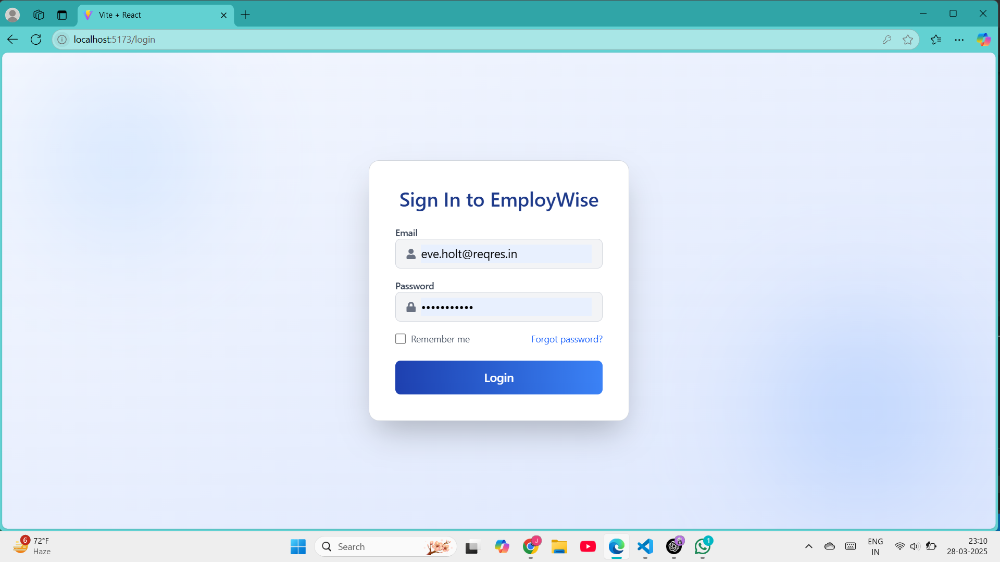
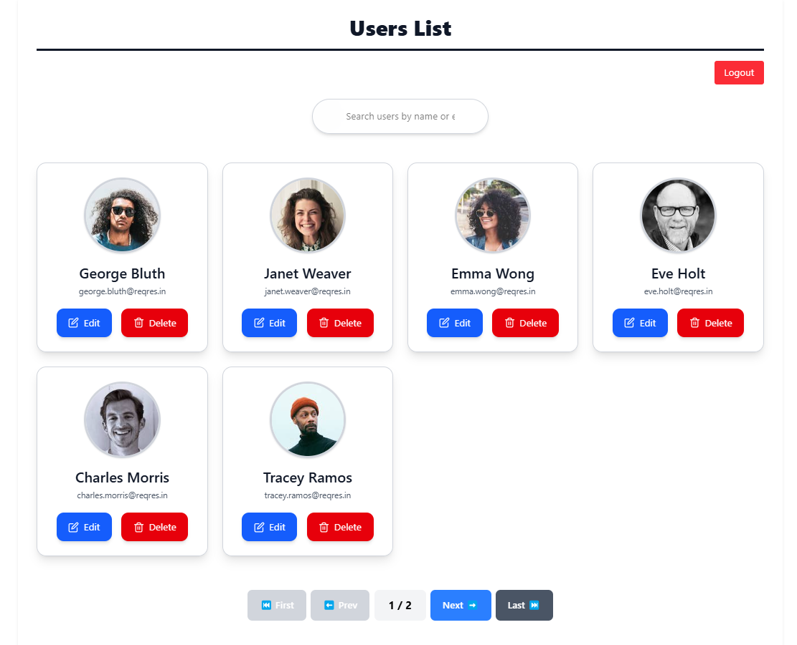
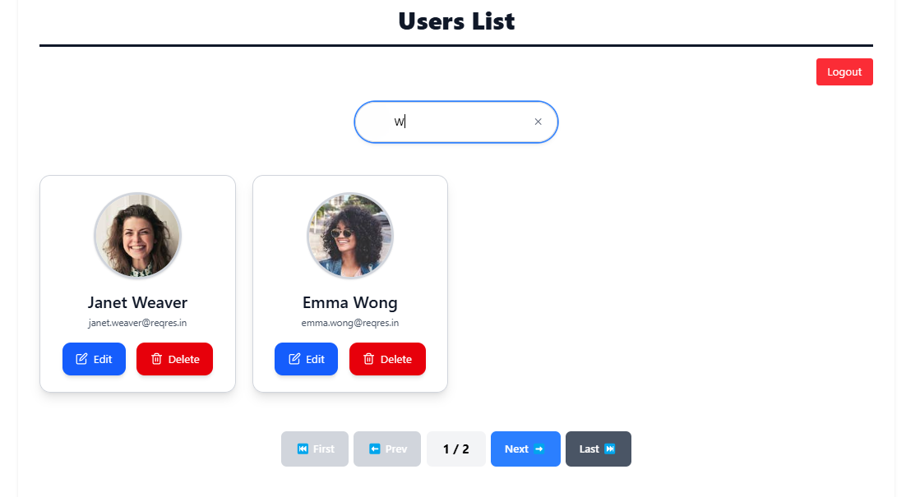
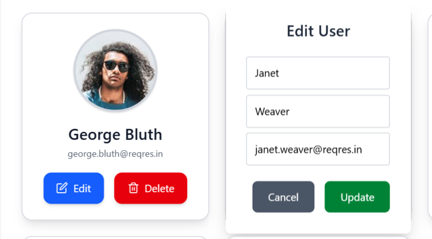

# Internship Assignment Submission

## 🚀 Project: User Management System
This project is a **React-based User Management System** developed as part of an **internship assignment**. It allows users to be fetched via an API, searched, updated, and deleted. The system also includes authentication using JWT.

## 🌍 Live Demo
[🔗 Deployed on Render](https://intern-assign-109g.onrender.com/)

> **Note:** Authentication is required to access the user list.The required credentials are: 
- Email : eve.holt@reqres.in
- Password : cityslicka

---

## 🛠 Tech Stack Used
- **Frontend:** React, React Router, TailwindCSS
- **API Calls:** Axios

---

## 🔧 Installation & Setup
To run the project locally, follow these steps:
```bash
# Clone the repository
git clone https://github.com/Jashans254/intern-assign.git

# Navigate to project directory
cd intern-assign

# Install dependencies
npm install

# Start the development server
npm start
```


---

## 🔍 API Endpoints Used
| Method | Endpoint | Description |
|--------|---------|-------------|
| `POST` | `/api/login` | Authenticate user (email & password in the body). |
| `GET` | `/users?page={page}` | Fetch users for a specific page. |
| `PUT` | `/api/users/{id}` | Update user details. |
| `DELETE` | `/users/{id}` | Delete a user by ID. |

---

## ✅ Features & Functionality
- 🔑 **Authentication (JWT-based)** – Redirects to login if not authenticated.
- 📄 **User Listing with Pagination** – Fetches users page-wise.
- 🔍 **Search & Filter** – Users can search by name/email.
- ✏️ **User CRUD Operations** – Edit/Delete users via API.

---

## 🗂 File Structure
```
/intern-assign
│── /src
│   ├── /components
│   │   ├── UserCard.jsx
│   │   ├── SearchFilter.jsx
│   │   ├── Pagination.jsx
│   │   ├── EditUserModal.jsx 
│   ├── /pages
│   │   ├── UsersList.jsx
│   │   ├── Login.jsx 
│   ├── /services
│   │   ├── api.js
│── package.json
│── README.md
```

---

## ✅ Assumptions & Considerations
- The API **requires authentication** (Authorization: Bearer `<token>`).
- Users are **fetched using pagination** (`?page=x`).
- If the token is **missing or invalid**, the user is **redirected to login** (handled via local storage).

## ✅ Screenshots
### Login Page
- 
### User List Page
- 
### search
- 
### Edit User Modal
- 

---

## 📩 Contact / Author Info
👨‍💻 **Developed by:** Jashanpreet Singh  
📧 **Email:** singh.jashan2456@gmail.com 
🔗 **GitHub:** [Jashans254](https://github.com/Jashans254)

---


